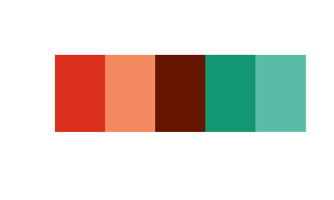
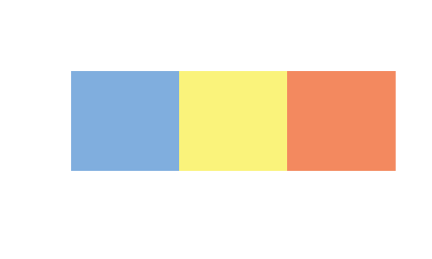
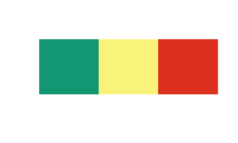
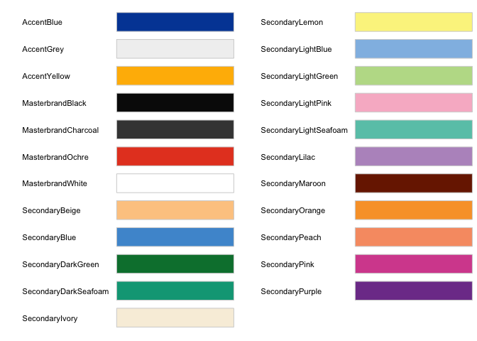

usydColours
================
Jazmin Ozsvar
04/06/2020


## The University of Sydney colour palettes

The `usydColours` package is intended to provide a set of colour
palettes for use with `ggplot2` and `plot` graphs. The palettes have
been derived from The University of Sydney Branding Document V2.0, and
include the primary branding palette as well as some novelty palettes
that capture the spirit and landmarks of the University.

For more information on University branding, refer to the following
links:  
\*
<https://intranet.sydney.edu.au/services/marketing-communications/our-brand.html>  
\*
<https://intranet.sydney.edu.au/content/dam/intranet/documents/services/marketing-communications/brand-documents/LR_Brand_Guidelines_V2.1_General.pdf>

For University branding R markdown presentation templates, go [here](https://github.com/emitanaka/USYDTemplates).

The functionality of usydColours is based on the wonderful `wesanderson`
package (<https://github.com/karthik/wesanderson>).

### Installation

``` r
install.packages("pak")
pak::pkg_install("Sydney-Informatics-Hub/usydColours")
```

### Usage

Below is a list of the currently available
    palettes.

    ##  [1] "primary"               "extended"              "secondary"            
    ##  [4] "pastel"                "complementary_ReGr"    "complementary_ReBl"   
    ##  [7] "bright"                "muted"                 "trafficlight"         
    ## [10] "heatmap"               "flametree"             "jacaranda"            
    ## [13] "harbour"               "sandstone"             "ochre"                
    ## [16] "greyscale"             "BlGrYe"                "BlOr"                 
    ## [19] "diverging_blue_red"    "diverging_blue_orange"

### Qualitative palettes

``` r
# Primary
util_visualise_pal(usyd_palettes[["primary"]])
```


``` r
# Extended
util_visualise_pal(usyd_palettes[["extended"]])
```


``` r
# Secondary
util_visualise_pal(usyd_palettes[["secondary"]])
```


``` r
# Pastel
util_visualise_pal(usyd_palettes[["pastel"]])
```


``` r
# Bright
util_visualise_pal(usyd_palettes[["bright"]])
```


### Sequential palettes

``` r
# Flame tree
util_visualise_pal(usyd_palettes[["flametree"]])
```


``` r
# Jacaranda
util_visualise_pal(usyd_palettes[["jacaranda"]])
```


``` r
# Sandstone
util_visualise_pal(usyd_palettes[["sandstone"]])
```


``` r
# Harbour
util_visualise_pal(usyd_palettes[["harbour"]])
```


``` r
# Ochre
util_visualise_pal(usyd_palettes[["ochre"]])
```


``` r
# Greyscale
util_visualise_pal(usyd_palettes[["greyscale"]])
```


### Diverging palettes

``` r
# Complementary (red/green)
util_visualise_pal(usyd_palettes[["complementary_ReGr"]])
```



``` r
# Complementary (red/blue)
util_visualise_pal(usyd_palettes[["complementary_ReBl"]])
```


``` r
# Muted
util_visualise_pal(usyd_palettes[["muted"]])
```



``` r
# Traffic light
util_visualise_pal(usyd_palettes[["trafficlight"]])
```



``` r
# Diverging (blue/red)
util_visualise_pal(usyd_palettes[["diverging_blue_red"]])
```


``` r
# Diverging (blue/orange)
util_visualise_pal(usyd_palettes[["diverging_blue_orange"]])
```


### Use with ggplot2

Below are some examples of `usydColours` in action.

#### Categorical data

``` r
# Bar graph with the primary palette
diamonds %>%
  filter(price < 1000) %>%
  ggplot(aes(price, fill = cut)) +
    geom_histogram(colour = "black", position = "dodge", binwidth = 250) +
    theme_bw() +
    scale_fill_manual(values = usyd_palette("primary"))
```


``` r
# Density graph with the muted palette
iris %>%
  ggplot(aes(x = Sepal.Length, fill = Species)) + 
    geom_density() +
    theme_bw() +
    facet_wrap(. ~ Species) +
    scale_fill_manual(values = usyd_palette("muted")) 
```


``` r
# Scatter plot using the jacaranda palette
diamonds %>%
  filter(row_number() %% 5 == 1) %>%
  filter(carat < 3) %>%
  filter(clarity %in% c("SI2", "SI1", "VS2", "VVS2")) %>%
  ggplot(aes(carat, price, colour = clarity)) +
    geom_jitter(alpha = 0.7) +
    theme_bw() +
    scale_colour_manual(values = usyd_palette("jacaranda"))
```


#### Continuous data

Use `usyd_palette` to interpolate colours between the discrete colours
of the available palettes for continuous data. Remember to supply values
for `n` and set `type = "continuous"`.

Tip: you can also use `usyd_palette` to generate more colours of your
favourite palette for categorical plots too\!

``` r
# Heatmap
mpg %>%
  count(class, drv) %>%
  complete(class, drv, fill = list(n = 0L)) %>%
  ggplot(aes(x = class, y = drv)) +
  geom_tile(mapping = aes(fill = n)) +
  theme_bw() +
  scale_fill_gradientn(colours = usyd_palette("flametree", 100, type = "continuous"))
```


``` r
library(maps)
library(mapproj)

# Chloropleth
# This example is from: https://cran.r-project.org/web/packages/viridis/vignettes/intro-to-viridis.html
unemp <- read.csv("http://datasets.flowingdata.com/unemployment09.csv",
                  header = FALSE, stringsAsFactors = FALSE)
names(unemp) <- c("id", "state_fips", "county_fips", "name", "year",
                  "?", "?", "?", "rate")
unemp$county <- tolower(gsub(" County, [A-Z]{2}", "", unemp$name))
unemp$county <- gsub("^(.*) parish, ..$","\\1", unemp$county)
unemp$state <- gsub("^.*([A-Z]{2}).*$", "\\1", unemp$name)

county_df <- map_data("county", projection = "albers", parameters = c(39, 45))
names(county_df) <- c("long", "lat", "group", "order", "state_name", "county")
county_df$state <- state.abb[match(county_df$state_name, tolower(state.name))]
county_df$state_name <- NULL

state_df <- map_data("state", projection = "albers", parameters = c(39, 45))

choropleth <- merge(county_df, unemp, by = c("state", "county"))
choropleth <- choropleth[order(choropleth$order), ]


ggplot(choropleth, aes(long, lat, group = group)) +
  geom_polygon(aes(fill = rate), colour = alpha("white", 1 / 2), size = 0.2) +
  geom_polygon(data = state_df, colour = "white", fill = NA) +
  coord_fixed() +
  theme_void() +
  ggtitle("US unemployment rate by county") +
  theme(axis.line = element_blank(), axis.text = element_blank(),
        axis.ticks = element_blank(), axis.title = element_blank()) +
  scale_fill_gradientn(colours = usyd_palette("muted", 100, type = "continuous"))
```


### Defining custom palettes

Want to make your own palette? No problem\! You can also define your own
palette by selecting colours of your choice with `usyd_pal_gen`.

Below is the full list of colour names contained in
`usydColours`.



After you’ve decided on what colours you want, use `usyd_pal_gen` as
shown below to make a custom palette.

``` r
# Define a new palette
my_palette <- usyd_pal_gen(
  "SecondaryDarkSeafoam", 
  "SecondaryLightSeafoam", 
  "AccentYellow", 
  "SecondaryLemon", 
  "SecondaryLilac") 

# Use the new palette
diamonds %>%
  filter(price < 1000) %>%
  ggplot(aes(price, fill = cut)) +
  geom_histogram(colour = "black", position = "dodge", binwidth = 250) +
  theme_bw() +
  scale_fill_manual(values = my_palette)
```


### RGB values and hex codes of colours

You can also refer to this table for RGB values and hex codes if you’d
like to apply them in Photoshop or any other code.

| colourName            |   R |   G |   B | hex      |
| :-------------------- | --: | --: | --: | :------- |
| AccentBlue            |   1 |  72 | 164 | \#0148A4 |
| AccentGrey            | 241 | 241 | 241 | \#F1F1F1 |
| AccentYellow          | 255 | 184 |   0 | \#FFB800 |
| MasterbrandBlack      |  10 |  10 |  10 | \#0A0A0A |
| MasterbrandCharcoal   |  66 |  66 |  66 | \#424242 |
| MasterbrandOchre      | 230 |  70 |  38 | \#E64626 |
| MasterbrandWhite      | 255 | 255 | 255 | \#FFFFFF |
| SecondaryBeige        | 253 | 202 | 144 | \#FDCA90 |
| SecondaryBlue         |  78 | 152 | 211 | \#4E98D3 |
| SecondaryDarkGreen    |   0 | 126 |  59 | \#007E3B |
| SecondaryDarkSeafoam  |   0 | 164 | 133 | \#00A485 |
| SecondaryIvory        | 248 | 239 | 221 | \#F8EFDD |
| SecondaryLemon        | 251 | 243 | 141 | \#FBF38D |
| SecondaryLightBlue    | 145 | 189 | 229 | \#91BDE5 |
| SecondaryLightGreen   | 189 | 220 | 150 | \#BDDC96 |
| SecondaryLightPink    | 248 | 185 | 204 | \#F8B9CC |
| SecondaryLightSeafoam | 104 | 198 | 182 | \#68C6B6 |
| SecondaryLilac        | 184 | 150 | 198 | \#B896C6 |
| SecondaryMaroon       | 122 |  32 |   0 | \#7A2000 |
| SecondaryOrange       | 249 | 161 |  52 | \#F9A134 |
| SecondaryPeach        | 247 | 156 | 114 | \#F79C72 |
| SecondaryPink         | 214 |  81 | 157 | \#D6519D |
| SecondaryPurple       | 127 |  63 | 152 | \#7F3F98 |
